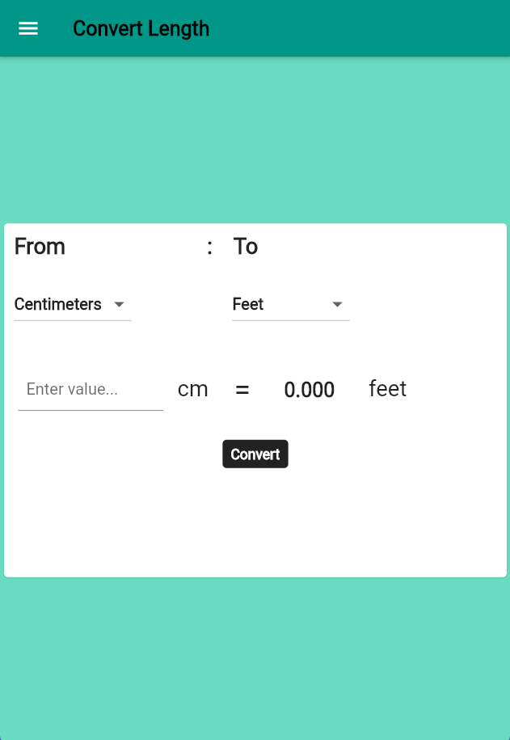

# Unit Conversion App using Flutter 2.0

Developement Stack 

## Getting Started

This project is a starting point for a Flutter application.

Resources used:

- [Lab: Write your first Flutter app](https://flutter.dev/docs/get-started/codelab)
- [Cookbook: Useful Flutter samples](https://flutter.dev/docs/cookbook)

Use flutter framework to run the project
1. Clone the repository 
2. Run `flutter run` in terminal
3. Run `main.dart` 

# Preview

